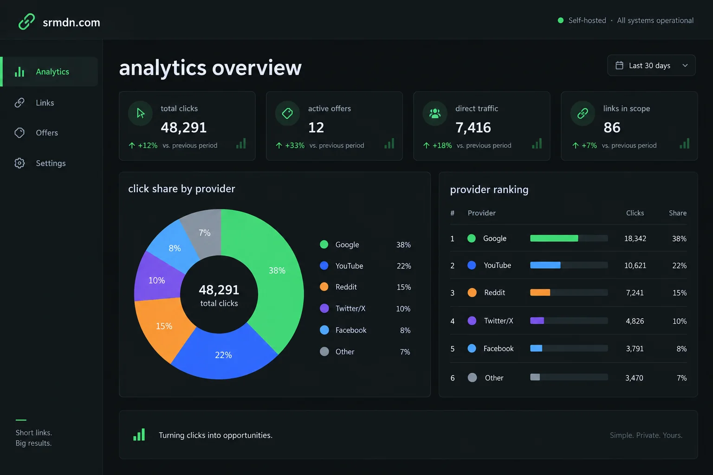

# plink

Self-hosted and production-ready.

Self-hosted personal link shortener. No prefix, no bloat — `yourdomain.com/my-link` goes straight to the destination.

```
yourdomain.com/shopee-referral  →  https://shopee.com/...?ref=xxx
yourdomain.com/tokopedia-promo  →  https://tokopedia.com/...
```

## Features

- Clean slugs — no `s/` prefix
- Click analytics — date-aware source reports, a last 30 days chart, and
  referrer breakdowns
- Strategy analytics — compare clicks by provider, channel, campaign, or slug
  with period filters, share charts, and provider ranking
- Promotion metadata — annotate each link with its provider, channel, and
  campaign without changing the public slug
- Categories — organize links with filterable labels
- Public resource search — find links by slug, description, or category
- Curated homepage — highlight recommended links before the full catalog
- Homepage curation — mark featured links and control priority from the dashboard
- Dashboard metrics — see link counts and total clicks at a glance
- Link management — search, filter, copy, export, edit, pause, and review analytics
- Source overview — see referrers across all links as well as per-link breakdowns
- Single binary — no runtime, no Docker required
- Self-hosted — your data stays on your server

## Stack

- **Go** — standard library HTTP server
- **SQLite** — one file database (`modernc.org/sqlite`, no CGo)
- **Vanilla HTML/JS** — no npm, no build step

## Quick start

**Requires Go 1.26.6+**

```bash
git clone https://github.com/srmdn/plink
cd plink
cp .env.example .env
# edit .env — set ADMIN_PASSWORD (required, no default)
go run ./cmd
# open the configured admin login path in your browser
```

## Configuration

Plink reads configuration from `.env` when it starts. Set `APP_TIMEZONE` to an
IANA timezone name to control the calendar-day boundaries used by analytics:

```env
APP_TIMEZONE=Asia/Jakarta
```

The default is `UTC`, which keeps a fresh installation predictable across
servers. Use the timezone for the people who operate the instance. The setting
controls the dashboard date filter, daily click export, last-30-days chart, and
last-click display. It does not change the Unix timestamps stored in SQLite.

## Security

- **CSRF protection** — double-submit cookie token on all state-changing requests
- **Rate limiting** — login attempts capped at 5 per IP per 15 minutes
- **Secure cookies** — set `APP_ENV=production` to enable `Secure` flag (HTTPS only)
- **Security headers** — CSP, HSTS, X-Frame-Options, and more applied automatically
- **URL validation** — only `http`/`https` redirect targets accepted

## Public homepage

Plink includes a conversion-focused public homepage with recommended links,
category browsing, and search. Visitors can expand the full resource catalog
when they need more than the curated view.

The footer links to Plink's GitHub repository so you can share or self-host
the project without exposing deployment-specific configuration.

## Dashboard

The admin dashboard keeps daily link management compact. It includes summary
metrics, live search, category, status, and date filtering, JSON and CSV export,
link controls, featured-link ordering, source overview analytics, and per-link
analytics.

## Analytics dashboard

The analytics dashboard turns redirect clicks into a promotion view. Filter by
period and group results by provider, channel, campaign, or individual slug.
The dashboard includes click-share charts, hover details, provider ranking with
average clicks per slug, and comparison with the previous period when a bounded
date range is selected.



*Illustrative preview with sample data; it is not a production snapshot.*

## Build

```bash
go build -o plink ./cmd
./plink
```

## Contributing

See [CONTRIBUTING.md](CONTRIBUTING.md).

## License

MIT
