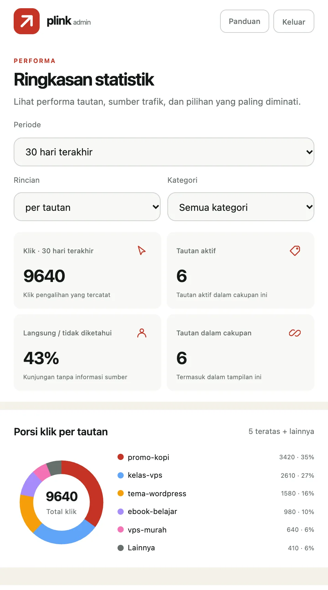

# plink

Self-hosted and production-ready.

Self-hosted personal link shortener. No prefix, no bloat — `yourdomain.com/my-link` goes straight to the destination.

```
yourdomain.com/shopee-referral  →  https://shopee.com/...?ref=xxx
yourdomain.com/tokopedia-promo  →  https://tokopedia.com/...
```

## Features

- Clean slugs — no `s/` prefix
- Click analytics — date-aware source reports, a last 30 days chart, and
  referrer breakdowns
- Strategy analytics — compare clicks by provider, channel, campaign, or slug
  with period filters, share charts, and provider ranking
- Offers — manage one public product or promotion card with multiple
  channel-specific tracking slugs, grouped and filterable by channel or campaign
- Offer lifecycle — manage active, paused, and ended programs across all their
  slugs, with shared visitor notices and optional fallback redirects
- Notice analytics — count notice views separately from redirect clicks
- Categories — organize links with filterable labels
- Public catalogs — search and paginate offer cards and standalone resource links
- Mobile storefront — centered 480px frame, bottom navigation, unified catalog
  search, services, and browser-local favorites
- Catalog types — products, referrals, services, and resources
- Featured picks — up to three manually scrollable cards, separate from the grid
- Storefront settings — edit the public name, description, affiliate disclosure,
  featured-pick visibility/limit, logo/favicon image URLs, and separate public/admin
  accent and background colors
- Channel attribution — each offer slug tracks its own clicks while the public
  card redirects straight to its affiliate destination
- Dashboard metrics — see link counts and total clicks at a glance
- Link management — search, filter, copy, export, edit, pause, and review analytics
- Source overview — see referrers across all links as well as per-link breakdowns
- Single binary — no runtime, no Docker required
- Self-hosted — your data stays on your server

## Stack

- **Go** — standard library HTTP server
- **SQLite** — one file database (`modernc.org/sqlite`, no CGo)
- **Vanilla HTML/JS** — no npm, no build step

## Quick start

**Requires Go 1.26.6+**

```bash
git clone https://github.com/srmdn/plink
cd plink
cp .env.example .env
# edit .env — set ADMIN_PASSWORD (required, no default)
go run ./cmd
# open the configured admin login path in your browser
```

## Configuration

Plink reads configuration from `.env` when it starts. Set `APP_TIMEZONE` to an
IANA timezone name to control the calendar-day boundaries used by analytics:

```env
APP_TIMEZONE=Asia/Jakarta
```

The default is `UTC`, which keeps a fresh installation predictable across
servers. Use the timezone for the people who operate the instance. The setting
controls the dashboard date filter, daily click export, last-30-days chart, and
last-click display. It does not change the Unix timestamps stored in SQLite.

`SITE_NAME` and `SITE_DESC` provide the initial public storefront identity.
Values saved later from the admin Settings page are stored in SQLite and take
precedence for public pages.

## Security

- **CSRF protection** — double-submit cookie token on all state-changing requests
- **Rate limiting** — login attempts capped at 5 per IP per 15 minutes
- **Secure cookies** — set `APP_ENV=production` to enable `Secure` flag (HTTPS only)
- **Security headers** — CSP, HSTS, X-Frame-Options, and more applied automatically
- **URL validation** — only `http`/`https` redirect targets accepted

## Public homepage

Plink uses a centered, mobile-width storefront with bottom navigation for
Beranda, Kategori, Jasa, and Favorit. The public catalog at `/offers` searches
both available offer cards and standalone resources. Category and provider
filters persist during search and pagination. `/links` remains the resource
catalog. Favorites are stored in the visitor's browser without login; unavailable
items are omitted from the favorites page.

Admin uses Tautan, Katalog, Statistik, and Pengaturan as its bottom navigation.
Panduan is available from the header and Settings. Catalog items have an explicit
product, referral, service, or resource type; services appear in the Jasa tab.
Legacy standalone links categorized as Service, Services, or Jasa also appear
there. Existing offers default to referral during migration; review their types
before publishing. Item type is separate from category and program status.

Settings controls the public name, description, referral disclosure, featured
pick visibility/limit, and independent public/admin accent and background colors.
The default palette follows Geopolitics: warm paper, dark ink, red accent, and
green supporting details. Colors accept six-digit hex values. Use a light
background and a contrasting accent. Featured picks scroll manually and are not
repeated in the homepage grid. Clicking a card still records its homepage slug's
redirect click. Browsing catalogs and saving favorites do not record clicks.

Program status controls every active slug attached to an Offer. Paused,
upcoming, and ended programs show one shared visitor notice; expired programs
also show a notice by default. End dates include the whole day in
`APP_TIMEZONE`. Add a message, official source, status effective date, and last
verification date in the Offer editor. These dates record context; only the
start and end dates schedule availability.

For previously published standalone links, select **use an existing standalone
link** when creating an Offer. Its slug, destination, and click history stay
unchanged. Attach other existing slugs in the Offer editor; their channel and
campaign labels remain intact. Only active standalone links can be attached,
and links already owned by another Offer cannot be reassigned this way.

Choose an automatic fallback redirect explicitly if the destination remains
appropriate after a program ends. Existing offers with a fallback URL retain
that redirect behavior during migration. With the notice behavior, the same
URL becomes an optional provider-website button, with no automatic forwarding.
Catalog visibility is separate from program status; hiding a card does not
pause its slugs. Disabling an individual Link still returns 404.

Notice views are stored separately and shown per Offer and channel slug. They
do not inflate redirect-click analytics; the provider-website button is a direct
link and is not counted as another redirect click. Public slug responses use
`Cache-Control: no-store`, and notice pages carry `noindex`. Schema migrations
run in a transaction per version, preserving existing links and click history.

The footer links to Plink's GitHub repository so you can share or self-host
the project without exposing deployment-specific configuration.

## Dashboard

The admin dashboard keeps daily link management compact. It includes summary
metrics, live search, category, status, and date filtering, JSON and CSV export,
link controls, source overview analytics, and per-link analytics. The Offers
workspace manages public cards, groups channel slugs under each offer, tracks
click totals per offer and slug, filters links by channel or campaign, and
controls homepage placement and expiry. Add channel links with an optional
campaign label to compare tracking slugs across a promotion.

## Analytics dashboard

The analytics dashboard turns redirect clicks into a promotion view. Filter by
period and group results by provider, channel, campaign, or individual slug.
The dashboard includes click-share charts, hover details, provider ranking with
average clicks per slug, and comparison with the previous period when a bounded
date range is selected.



*Illustrative preview with sample data; it is not a production snapshot.*

## Build

```bash
go build -o plink ./cmd
./plink
```

## Contributing

See [CONTRIBUTING.md](CONTRIBUTING.md).

## License

MIT

### SEO and social sharing

Public home, catalog, services, and resources render descriptions, canonical URLs,
Open Graph metadata, and Twitter card tags on the server. Configure the homepage
SEO title, description, and optional share-image URL under **Settings → SEO & berbagi**.
Empty SEO fields follow the site identity. Empty image settings use a generated
1200×630 PNG with the public palette; no external image-generation service is required.
The settings preview displays the saved configuration. Custom images should be
publicly accessible PNG/JPG files, ideally 1200×630, referenced by HTTPS URL or a
local site path. Logo and favicon remain separate settings.

`/robots.txt` and `/sitemap.xml` list the public sections. Admin/API responses,
favorites, search/filter results, and program notices are marked `noindex`.
Human visits to active short links retain their direct 302 redirect. When automatic
item previews are enabled, recognized social-preview crawlers receive server-rendered
metadata from the attached catalog item on the same slug; no extra share URL or
public item detail page is required. Verify real social previews after deployment
at the public URL, since crawlers cannot reach localhost and may cache old cards.
Schema v11 adds three optional SEO settings and preserves existing values.

### Public address and editable copy

Settings → SEO & berbagi includes **Alamat publik**. A saved origin overrides
`PUBLIC_URL`; clearing it restores the environment fallback, then the request
origin. The same origin is used for copied links, exports, canonical URLs,
sitemap, and the generated card domain. It changes generated addresses, not DNS
or the listening address. Production requires HTTPS and rejects paths, query
strings, fragments, credentials, and invalid ports. HTTP is supported in development.

Settings → Konten beranda & jasa edits the hero label/title/description and service
section title/description. Schema v12 preserves the previous copy as defaults.
The program notice shares the public theme and configured logo. Generated OG cards
can use public HTTPS PNG/JPG/WebP logos or embedded `/js/` raster assets. Remote
logos have time, byte, pixel, redirect, and public-network limits. Unsupported SVG
or unreachable logos use the default mark; a custom share image is available for
full art direction. Generated card variants are cached in memory.

### Automatic catalog item previews

Settings → SEO & berbagi includes **Preview otomatis per item Katalog**, enabled
by default (schema v13). All active channel slugs inherit the attached item's title,
description and image without duplicate fields. Missing descriptions use the item
title/provider; missing images generate a themed 1200×630 card. Site share images
remain section-level defaults and do not replace item-specific cards.

Recognized Facebook/Meta, X, LinkedIn, WhatsApp, Discord, Slack, Telegram and
Pinterest preview user agents receive metadata HTML. Browser visits retain the
existing destination or lifecycle notice/fallback behavior; ordinary search
crawlers retain redirects. Detection is based on user-agent hints, not verified
identity, and unknown preview clients still receive the normal redirect.

Known preview fetches and HEAD requests do not count as redirect clicks or notice
views. Paused, upcoming, expired and ended item previews use current status text
and generated status imagery instead of promotional images, including when the
owner has selected a human fallback redirect. Disabled or missing slugs remain 404.
Responses vary by User-Agent and use no-store. Social platforms can still retain
cached previews; test the actual public slug on the platforms you use after
deployment. Generated images have a bounded 16-variant in-memory cache, short
HTTP cache lifetime and metadata-versioned URLs. No remote destination scraping,
new mandatory fields, or per-item OG overrides are introduced.
